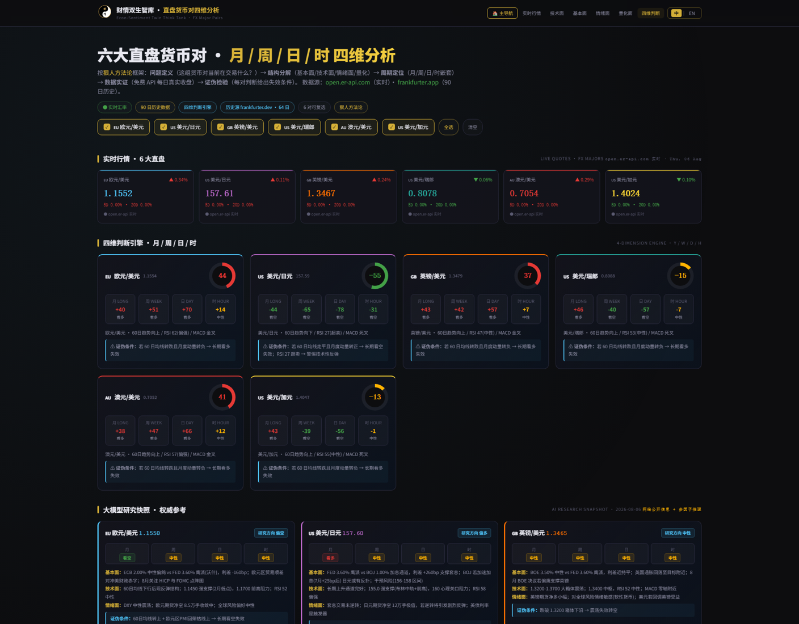
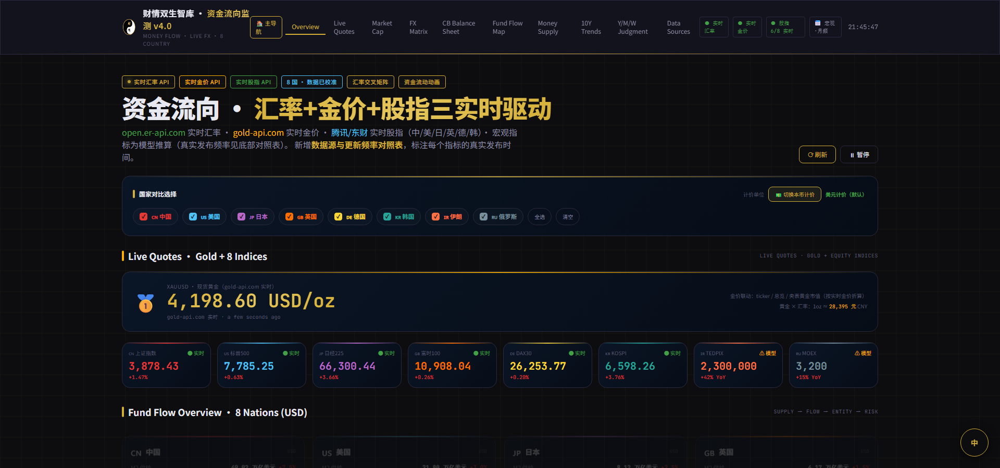

<div align="center">

# 财情双生智库 · Econ-Sentiment Twin Think Tank

<div align="center">

[](https://wecando-vip.github.io/macro-analysis/)

**🚀 在线访问（免部署 · 推送 main 自动更新）**：https://wecando-vip.github.io/macro-analysis/

</div>


**金融 × 情绪 · 对立统一 · 一站式资产决策系统**

[](LICENSE)


**财 情 双 生 · 智 慧 有 温 度**
**苦 难 变 智 慧 · 矛 盾 变 双 赢 · 烦 恼 变 成 长**

</div>

---

财情双生智库是一套**个人资产决策工具集**（Financial × Emotional Twin Think Tank），将理性金融分析与市场情绪判断双轨合一，覆盖宏观监控、周期定位、资金流向、股债汇、黄金、直盘货币对六大维度，帮助你看清市场、校准决策。

**纯静态 · 零构建 · 零后端** —— 单文件 HTML 即可运行，数据全部来自免费公开 API，浏览器端实时拉取。

> 🌐 **在线体验**：[http://118.25.197.75:3050/](http://118.25.197.75:3050/)（中文版默认入口）
> 🇺🇸 **English**：[http://118.25.197.75:3050/index-en.html](http://118.25.197.75:3050/index-en.html)

---

## ✨ 特性亮点

| 特性 | 说明 |
|------|------|
| 🌍 **7 大子系统** | 宏观监控 / 美林时钟 / 周金涛周期 / 资金流向 / 股债汇 / 黄金 / 直盘货币对 |
| 🧠 **财情方法论** | 五阶段框架：问题定义 → 结构分解 → 周期定位 → 数据实证 → 证伪检验（可证伪性 > 可解释性）|
| 🇨🇳🇺🇸 **中英双语** | 中英文独立页面分离（`apps/` + `apps-en/`），顶部「中 \| EN」语言对互通，中文为默认入口 |
| 📡 **免费实时数据** | 汇率 / 金价 / 8 国股指 / 货币对 90 日历史 —— 全免费 API、无需 key、CORS 友好 |
| 📊 **多维判断引擎** | 月 / 周 / 日 / 时四周期嵌套定位，基本面 + 技术面 + 情绪面 + 量化面四维独立分析 |
| 🛡 **证伪条件** | 每个判断都给出明确的「失效条件」，拒绝事后解释，诚实面对不确定性 |
| ⚡ **零构建部署** | 纯 HTML + CSS + Vanilla JS，GitHub Pages / Nginx / 任意静态服务器直接跑 |

---

## 🎯 7 大子系统

| # | 系统 | 目录 | 用途 | 简明使用场景 |
|---|------|------|------|-------------|
| 01 | **宏观监控系统** | `apps/01-macro-surveillance/` | 5 维度全球压力仪表 | 开盘前看「综合压力指数」+「市场传染」→ 判断今日风险偏好 |
| 02 | **美林时钟** | `apps/02-merrill-clock/` | 8 国同步周期定位 | 勾选 3 国 → 看三国时钟象限 + 10Y 利差 → 找套利窗口 |
| 03 | **周金涛三国周期** | `apps/03-zhoujintao-cycle/` | 康波 50-60 年长波 | 每月看「核心结论」→ 校准宏观战略 → 大类资产久期 |
| 04 | **资金流向监测** ⭐ | `apps/04-fund-flow/` | 8 国资金链 + 实时三件套 | 必看系统 → 顶部 4 源状态 → 实时行情 → 央行资产负债表 |
| 05 | **股债汇监测** | `apps/05-stock-bond-fx/` | 8 国 3 市场三维趋势 | 勾选 5 国 → 看「年/月/周」三维信号 → 找出强势上行 |
| 06 | **黄金 XAUUSD** | `apps/06-gold-xauusd/` | 四维单品种深探 | 日内看「日线」+ 蜡烛图 → 中期看「金银比」+ 调权重 |
| 07 | **直盘货币对** | `apps/07-fx-pairs/` | 6 大直盘四维分析（财情方法论） | 交易前看月/周/日/时四维信号 → 多维度共振做单 → 设证伪条件止损 |

> 💡 第 07 系统「直盘货币对」是**财情方法论的完整实践**：6 对直盘（EUR/USD、USD/JPY、GBP/USD、USD/CHF、AUD/USD、USD/CAD）可复选，内置大模型研究快照兜底，API 挂掉时页面依然有权威研究内容。

### 📐 财情方法论（Finance-Emotion Methodology）

将金融分析（财）与市场心理/情绪判断（情）双轨合一的分析框架：

```
① 问题定义  → 这组货币对当前在交易什么？（基本面驱动？动量延续？套息？）
② 结构分解  → 基本面 / 技术面 / 情绪面 / 量化面 四个独立分析维度
③ 周期定位  → 月（60日+30动量）/ 周（20日+10动量）/ 日（MA5/20+RSI+MACD）/ 时（5日动量）
④ 数据实证  → 免费 API 真实数据（open.er-api.com 实时 + frankfurter.dev 90 日历史）
⑤ 证伪检验  → 每对给出 2-3 个「判断失效条件」（可证伪性 > 可解释性）
```

> 方法论核心：**可证伪性 > 可解释性** —— 每个判断都必须给出明确的「失效条件」，宁可诚实承认不确定性，也不搞事后解释。

---

## 📸 界面预览

| 门户中文版 | 直盘货币对 · 财情方法论 |
|------------|------------------------|
|  |  |

| 资金流向 · 实时三件套 | 门户英文版 |
|----------------------|-----------|
|  |  |

---

## 🧭 中英双语架构

中文版为**默认入口**，中英文**独立页面分离**（非 JS 切换，SEO 友好、爬虫可索引）：

```
门户中文 index.html ──EN──→ 门户英文 index-en.html
门户英文 index-en.html ──中──→ 门户中文 index.html
apps/XX（中）──EN──→ apps-en/XX（英）      apps-en/XX（英）──中──→ apps/XX（中）
```

- 品牌名统一：**财情双生智库 · Econ-Sentiment Twin Think Tank**（中英并排）
- 英文版 `<html lang="en">` + 独立 meta description
- 7 套子系统全部拥有中英两个版本（`apps/` + `apps-en/`）

---

## 🚀 快速开始

```bash
# 1. 克隆项目
git clone https://github.com/YOUR_USERNAME/macro-analysis.git
cd macro-analysis

# 2. 启动本地服务器（任选其一）
python -m http.server 8080     # Python
npx serve .                    # Node.js

# 3. 浏览器访问
open http://127.0.0.1:8080/
```

> 也可以直接双击打开 `index.html`（所有页面为单文件 HTML，浏览器均支持，无需任何构建步骤）。

---

## 📁 目录结构

```
macro-analysis/
├── LICENSE                            ← MIT 许可证
├── README.md                          ← 本文件
├── README-en.md                       ← English readme（英文版）
├── .gitignore                         ← Git 忽略规则
├── index.html                         ← 🏠 顶层导航页 · 中文版（默认入口）
├── index-en.html                      ← 🌐 门户英文版
├── _assets/                           ← 共享资源
│   ├── logo.png                       ← 财情双生 logo（透明背景）
│   └── screenshots/                   ← 界面截图（README 引用）
├── apps/                              ← 7 套子系统 · 中文版
│   ├── 01-macro-surveillance/index.html
│   ├── 02-merrill-clock/index.html
│   ├── 03-zhoujintao-cycle/index.html
│   ├── 04-fund-flow/
│   │   ├── index.html                 ← v5.0（最新）
│   │   └── index-v1.html              ← v1.0（3 国原版）
│   ├── 05-stock-bond-fx/index.html
│   ├── 06-gold-xauusd/
│   │   ├── index.html                 ← v2.0（最新）
│   │   └── index-v1.html              ← v1.0（基础版）
│   └── 07-fx-pairs/index.html         ← 直盘货币对 · 财情方法论
└── apps-en/                           ← 7 套子系统 · 英文版（与 apps 平行）
    ├── 01-macro-surveillance/index.html
    ├── 02-merrill-clock/index.html
    ├── 03-zhoujintao-cycle/index.html
    ├── 04-fund-flow/index.html
    ├── 05-stock-bond-fx/index.html
    ├── 06-gold-xauusd/index.html
    └── 07-fx-pairs/index.html
```

---

## ⏱ 数据源与更新频率

| 层级 | 数据 | 更新频率 | 来源 |
|------|------|---------|------|
| 🔄 **实时层** | 汇率 · 8 国 | 每日 UTC 00:02 | [open.er-api.com](https://open.er-api.com) |
| | 黄金 XAUUSD | 秒级 | [api.gold-api.com](https://gold-api.com) |
| | A股 / 标普500 | 盘中实时 | [qt.gtimg.cn](https://qt.gtimg.cn) |
| | 日经 / DAX / FTSE / KOSPI | 盘中实时 | [push2delay.eastmoney.com](https://push2delay.eastmoney.com) |
| | 直盘货币对（实时） | 每日 UTC 00:02 | open.er-api.com |
| | 直盘货币对（90 日历史） | 工作日收盘 | [api.frankfurter.dev](https://frankfurter.dev) |
| 📅 **官方发布** | M2 / 社融 / 央表 / CPI | 月/周频 | 各国央行 |
| 📊 **估算层** | 股票/房产市值 | 年度快照 | 交易所/机构估算 |
| | TEDPIX / MOEX 股指 | 无免费源 | ⚠️ 模型推算（标注）|
| 🧠 **研究层** | 直盘货币对研究快照 | 内置权威参考 | 网络公开信息 + 多因子推理 |

> 📌 每个页面顶部都有**数据源状态徽章**（实时 / 官方发布 / 模型推算），底部有完整「数据源与更新频率对照表」，一眼看清数据新旧。

---

## 🌐 部署

### 方式一：GitHub Pages（推荐开源发布）

```bash
cd macro-analysis
git init
git add .
git commit -m "feat: 财情双生智库 宏观分析 v1.0 · 7 套子系统整合（中英双语）"
git branch -M main
git remote add origin https://github.com/YOUR_USERNAME/macro-analysis.git
git push -u origin main
```

1. GitHub 仓库 → **Settings** → **Pages**
2. Source: **Deploy from a branch** → Branch: **main** / **(root)**
3. 保存后访问：`https://YOUR_USERNAME.github.io/macro-analysis/`

### 方式二：Nginx / 宝塔面板（当前线上）

项目已部署于腾讯云（Ubuntu 22.04 + 宝塔 nginx），监听 `3050` 端口：

```nginx
server {
    listen 3050;
    server_name 118.25.197.75;
    root /www/wwwroot/118.25.197.75_3050;
    index index.html;
    location / {
        try_files $uri $uri/ =404;
    }
    location ~* \.(png|jpg|svg|css|js)$ {
        expires 30d;   # 静态资源缓存
    }
    location ~* (README|LICENSE|\.gitignore|\.env) {
        return 404;    # 敏感文件保护
    }
}
```

---

## 🎨 设计系统

- **主背景**：深渊黑 `#0D0D0F`
- **次背景**：星夜蓝 `#0A1628`
- **主强调色**：点睛金 `#D4AF37`
- **涨色（A股惯例）**：红 `#E53935` · **跌色**：绿 `#43A047`
- **字体**：Noto Sans SC / Noto Serif SC / JetBrains Mono

品牌哲学：**财情双生（Finance + Emotion）** · 阴阳平衡 · 对立统一 · 沉稳深邃 · 金光点睛。

---

## 🛠 技术栈

- **前端**：纯 HTML + CSS + Vanilla JS（**零构建**，单文件架构）
- **图表**：[Chart.js](https://www.chartjs.org/)（CDN）
- **数据源**：免费公开 API（无需 key）
  - 汇率：[open.er-api.com](https://open.er-api.com)
  - 金价：[api.gold-api.com](https://gold-api.com)
  - 股指：[qt.gtimg.cn](https://qt.gtimg.cn) + [push2delay.eastmoney.com](https://push2delay.eastmoney.com)
  - 货币对历史：[api.frankfurter.dev](https://frankfurter.dev)
- **部署**：任意静态服务器（GitHub Pages / Nginx / CloudStudio / Vercel）

---

## 📋 系统版本

| 系统 | 版本 | 状态 |
|------|------|------|
| 宏观监控系统 | v1.0 | ✅ 稳定 |
| 美林时钟宏观监控系统 | v4.0 | ✅ 稳定 |
| 周金涛三国周期分析报告 | v5.1 | ✅ 稳定 |
| 资金流向监测系统 | v5.0 | ✅ 最新 |
| 股债汇监测系统 | v1.0 | ✅ 稳定 |
| 黄金 XAUUSD 监控系统 | v2.0 | ✅ 稳定 |
| 直盘货币对四维分析 | v1.4 | ✅ 最新（财情方法论）|

---

## 🤝 贡献

欢迎通过以下方式参与：

- 🐛 **报告问题**：提 [Issue](https://github.com/YOUR_USERNAME/macro-analysis/issues) 描述 bug 或建议
- 🚀 **提交代码**：Fork → 修改 → Pull Request
- 📚 **完善文档**：补充翻译、修正错别字、增加用法示例
- 📊 **新数据源**：接入更多免费 API（CORS 友好优先）

---

## 📜 免责声明

本站所有数据仅供**研究学习**，**不构成投资建议**。市场有风险，投资需谨慎。数据来源为免费公开接口，可能存在延迟或误差；模型推算数据已明确标注。

---

## 👤 作者

**财情双生智库 · Econ-Sentiment Twin Think Tank** · 易和中

*苦 难 变 智 慧 · 矛 盾 变 双 赢 · 烦 恼 变 成 长 · 让 智 慧 有 温 度*

---

## 📄 许可证

本项目采用 **MIT License**（详见 [LICENSE](LICENSE)）。

MIT 许可证允许任何人自由使用、复制、修改、合并、发布、分发、再许可和/或销售本软件的副本，前提是保留原始版权声明和许可声明。

### 第三方资源

| 资源 | 版权/许可 |
|------|----------|
| Chart.js（CDN 引入） | MIT License |
| 财情双生 logo | © 2026 财情双生智库，保留所有权利（不随 MIT 授权开放）|
| 免费数据 API | 各自服务条款（open.er-api.com / gold-api.com / qt.gtimg.cn / push2delay.eastmoney.com / frankfurter.dev）|
